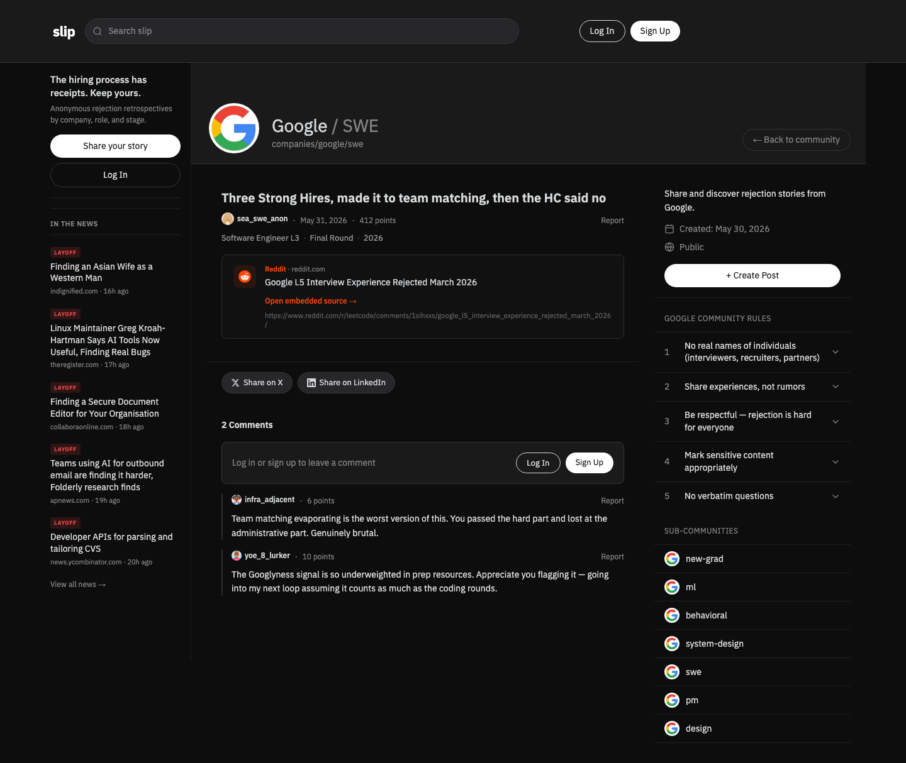

# slip

> Rejection is a data point.

[Live Product](https://slip.wtf/) · [Report a Security Issue](SECURITY.md)

[](https://nextjs.org/)
[](https://react.dev/)
[](https://orm.drizzle.team/)
[](https://github.com/suandhee12-commits/slip/actions/workflows/ci.yml)
[](LICENSE)

**slip** is an anonymous community that turns rejection experiences from hiring and fundraising into structured reflection data. People can document a company, role, interview stage, investor, or funding round and connect that experience to what happened next.



Unlike career platforms that preserve only successful outcomes, slip records **what the process looked like and what changed afterward**.

## The Problem

Rejection is valuable learning data, but it is usually scattered across private notes and short-lived community posts.

- Experiences from the same company and stage are difficult to compare.
- Anonymity and trust are difficult to maintain together.
- Most stories end at the rejection instead of recording the later outcome.
- Useful posts lose the context of company, role, interview stage, or funding round.

slip connects each story to a structured community and stage, then keeps reactions, discussion, and follow-up outcomes attached to the same record.

## Implemented Features

| Area | What is implemented |
| --- | --- |
| Structured reflection | Company and investor communities, job and interview stages, funding rounds, and later outcomes |
| Anonymous community | Anonymous publishing, comments, votes, reactions, and reports |
| Discovery | Community pages, tags, search, and a following feed |
| Follow-up records | Outcome updates and 30-day reminder notifications |
| Trust and operations | Community rules, moderation status, and admin review |
| Content | Editor.js posts, image uploads, and external post embeds |
| Authentication | Supabase Auth sessions and user profiles |

## Product Flow

```text
Write an experience
  → Select a company/investor and stage
  → Publish anonymously or publicly
  → Collect comments, votes, and reactions
  → Record the later outcome
  → Add it to a comparable body of reflection data
```

## Technical Decisions

### Hierarchical communities

A route such as `companies/google/swe` represents both a parent organization and a child role. Companies, investors, and specialties share the same feed and URL model instead of requiring separate product surfaces.

### A data model that continues after rejection

Posts include interview or fundraising stages as well as `outcomeCategory`, `outcomeStory`, and `outcomeNudgeSentAt`. This preserves what changed after the initial rejection instead of freezing the story at one moment.

### Connection management for serverless workloads

PostgreSQL connections are reused during development hot reload, prepared statements are disabled for transaction poolers, and idle connections are released. The fix lives at the database boundary so every page benefits from the same connection behavior.

### Controlled home-feed cost

User-specific authentication is isolated from cacheable server rendering. Counts, recent posts, and suggested communities are fetched in parallel before duplicate posts are removed.

## Architecture

```text
Next.js App Router
├── Server Components ───── feeds, communities, and posts
├── Route Handlers ──────── publishing, comments, votes, reactions, reports
├── Supabase SSR ────────── authentication and sessions
├── Drizzle ORM ─────────── typed queries and schema
└── PostgreSQL ──────────── users, communities, posts, and interactions
```

## Data Model

```text
users ─┬─ posts ─┬─ comments
       │         ├─ votes
       │         ├─ reactions
       │         ├─ reports
       │         └─ post_tags ─ tags
       ├─ community_members
       └─ notifications

communities ── self-reference for organization and role hierarchies
```

## Quick Start

### Requirements

- Node.js 20+
- PostgreSQL
- A Supabase project

### Installation

```bash
git clone https://github.com/suandhee12-commits/slip.git
cd slip
npm ci
cp .env.example .env.local
```

Add the PostgreSQL and Supabase values to `.env.local`, then run:

```bash
npx drizzle-kit migrate
npm run dev
```

The development server runs at [http://localhost:3004](http://localhost:3004).

## Environment Variables

| Variable | Purpose |
| --- | --- |
| `DATABASE_URL` | PostgreSQL connection string |
| `NEXT_PUBLIC_SUPABASE_URL` | Supabase project URL |
| `NEXT_PUBLIC_SUPABASE_ANON_KEY` | Public browser and SSR key |
| `SUPABASE_SERVICE_ROLE_KEY` | Server-side administrative operations |
| `NEXT_PUBLIC_APP_URL` | Canonical and callback URL; use `https://slip.wtf` in production |
| `FOUNDER_EMAIL` | Email used to identify the administrator |
| `FOUNDER_PASSWORD` | Initial password used only by the admin creation script |

## Commands

```bash
npm run dev      # localhost:3004
npm run build    # production build
npm run start    # production server
npm run lint     # ESLint
npm test         # regression test
```

## Verification

| Check | Current result |
| --- | --- |
| TypeScript | Passed |
| Production build | Passed |
| Static page data | Verified after PostgreSQL migration |
| ESLint | Passed with 0 errors |
| Regression test | Passed; preserves the first post when titles or URLs are duplicated |
| GitHub Actions | Runs PostgreSQL 16, migrations, lint, tests, and build |

The same checks run in [`.github/workflows/ci.yml`](.github/workflows/ci.yml).

## Repository Structure

```text
slip/
├── src/app/                 # Pages and route handlers
├── src/components/          # Feed, editor, comment, and community UI
├── src/lib/                 # Supabase, types, and deduplication
├── drizzle/
│   ├── schema.ts            # PostgreSQL schema
│   └── migrations/          # Versioned migrations
├── scripts/                 # Seed, operations, and verification tools
└── public/                  # Brand and static assets
```

## Data Safety

- Keep test data separate from real user data.
- Never commit `SUPABASE_SERVICE_ROLE_KEY` or database credentials.
- Remove personal, interviewer, and confidential information before publishing real experiences.

## License

[MIT](LICENSE). Please use the private reporting process in [`SECURITY.md`](SECURITY.md) for vulnerabilities.
